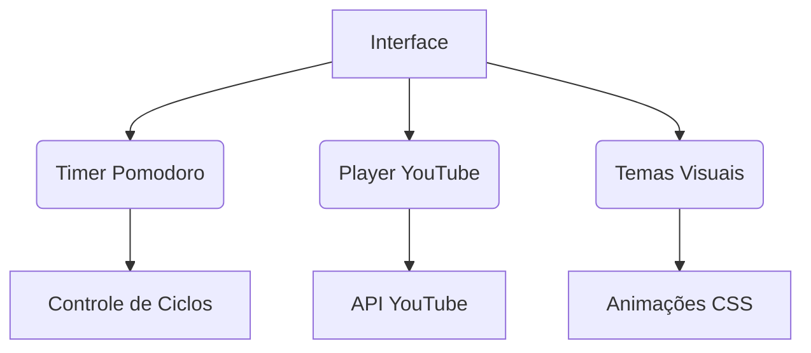

# Pomodoro Multitemático 🍅🎨

## 📌 Visão Geral
O **Pomodoro Multitemático** é um sistema de gestão de tempo baseado na técnica Pomodoro (25 minutos de trabalho / 5 minutos de descanso), integrado a playlists do YouTube e personalizável com temas visuais imersivos. Combina funcionalidades práticas com elementos lúdicos para aumentar a produtividade e o engajamento do usuário.

## 🎯 Objetivos
- Fornecer um timer Pomodoro funcional e intuitivo
- Integrar música de foco (lo-fi) via playlists do YouTube
- Oferecer experiências visuais temáticas (oceânica, espacial, etc.)
- Ser acessível em dispositivos desktop e mobile

## 🚀 Funcionalidades Principais
| Funcionalidade          | Descrição                                                                 |
|-------------------------|---------------------------------------------------------------------------|
| Timer Pomodoro          | Ciclos de 25min (trabalho) e 5min (descanso) com controles de início/pausa/reset |
| Player YouTube Integrado| Reprodução automática de playlists pré-configuradas                       |
| Temas Visuais           | Opções de temas imersivos com animações personalizadas                    |
| Interface Responsiva    | Adaptação a diferentes tamanhos de tela                                   |
| Personalização          | Ajuste de volumes, tempos de ciclo e seleção de playlists                 |

## ⚙️ Requisitos Técnicos
### Tecnologias Utilizadas
- **Frontend**: HTML5, CSS3, JavaScript
- **APIs**: YouTube IFrame Player API
- **Bibliotecas**: Font Awesome (ícones)
- **Hospedagem**: Servidor web estático

### Pré-requisitos
- Navegador moderno (Chrome, Firefox, Edge)
- Conexão com internet

## 🏗️ Arquitetura do Sistema

## 🎨 Temas disponiveis
**Oceânico** 🌊
Elementos: Bolhas animadas, plantas marinhas, gradientes azulados

Interação: Fundo muda de cor entre ciclos (azul → verde)

**Espacial** 🚀
Elementos: Estrelas cadentes, planetas pulsantes, efeitos neon

Interação: Efeitos de propulsão ao iniciar o timer

## 📖 Manual do Usuário
**Configuração Inicial**
Substitua o ID da playlist do YouTube no código (variável list)

Hospede os arquivos em um servidor web

// No arquivo script.js
list: 'SEU_ID_PLAYLIST'
